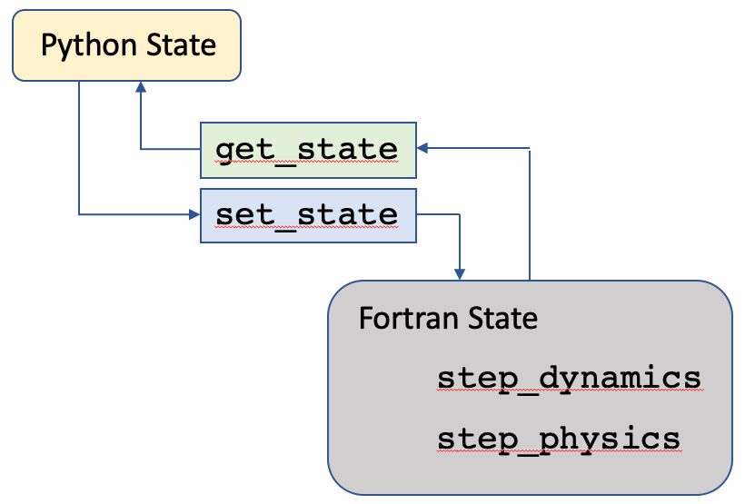

fv3gfs-wrapper
==============

fv3gfs-wrapper (:code:`import fv3gfs.wrapper`), is a Python wrapper for the FV3GFS global climate model. It provides functions which can be used in a "runfile" to define a main loop and execute the Fortran FV3GFS model. In this runfile you can modify and extend the behavior of the model. We have several `example runfiles`_ in the Github repository.

Running the examples and tests requires using google cloud credentials to cover data transfer costs. This is described further in the :ref:`Readme`.

At a high level, the wrapper can be thought of as a Fortran state, routines for evolving the Fortran state using the Fortran model, and routines to retrieve and set that state from Python.

ith get_state flowing from Fortran to Python and set_state flowing from Python to Fortran.

Usage of the getters and setters is described in :ref:`State`. Details about the implementation of the features and the build system are included in our :ref:`Developers Notes`.

.. toctree::
   :maxdepth: 2
   :caption: Contents:

   readme
   installation
   usage
   state
   developers
   api
   history

Indices and tables
==================
* :ref:`genindex`
* :ref:`modindex`
* :ref:`search`

.. _`example runfiles`: https://github.com/VulcanClimateModeling/fv3gfs-wrapper/tree/master/examples/runfiles
